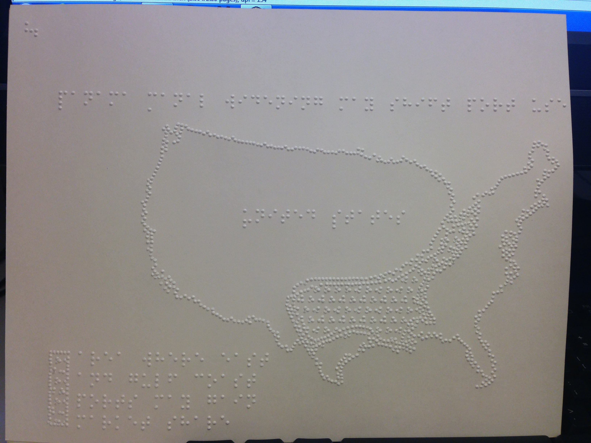

Original story: [Arrival of big ships to reshape flow of goods in US](https://www.ft.com/content/0e43acfa-9344-11e7-a9e6-11d2f0ebb7f0) by [Greg Meyer](https://www.ft.com/stream/50863fe6-83d9-3cc7-9904-aae3ad949e3a).

Original graphic by [Joanna S Kao](https://twitter.com/joannaskao).

